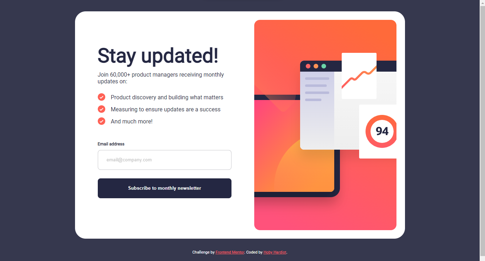
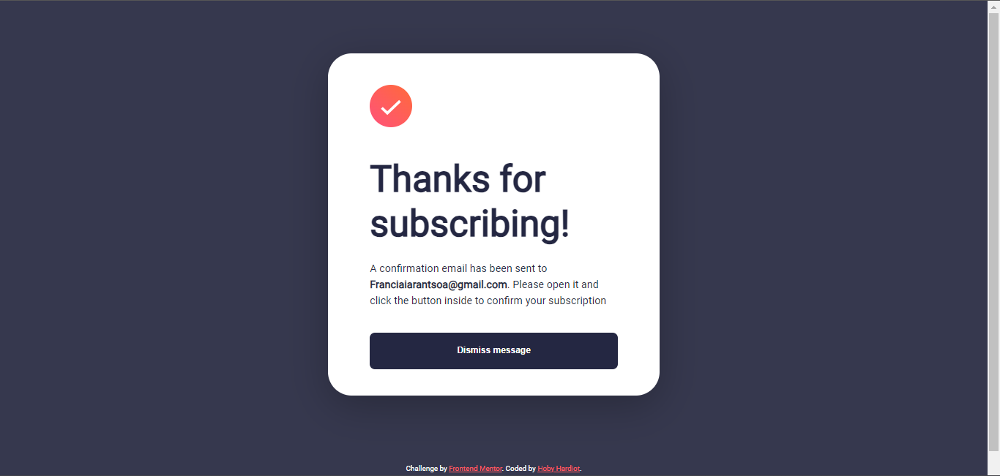

# Frontend Mentor - Newsletter sign-up form with success message solution

This is a solution to the [Newsletter sign-up form with success message challenge on Frontend Mentor](https://www.frontendmentor.io/challenges/newsletter-signup-form-with-success-message-3FC1AZbNrv). Frontend Mentor challenges help you improve your coding skills by building realistic projects. 

## Table of contents

- [Overview](#overview)
  - [The challenge](#the-challenge)
  - [Screenshot](#screenshot)
  - [Links](#links)
- [My process](#my-process)
  - [Built with](#built-with)
  - [Useful resources](#useful-resources)
- [Author](#author)
 

## Overview

### The challenge

Users should be able to:

- Add their email and submit the form
- See a success message with their email after successfully submitting the form
- See form validation messages if:
  - The field is left empty
  - The email address is not formatted correctly
- View the optimal layout for the interface depending on their device's screen size
- See hover and focus states for all interactive elements on the page

### Screenshot

### Links

- Solution URL : [Solution](https://www.frontendmentor.io/solutions/newsletter-sign-up-with-success-message-and-animation-FnfMtBkEDZ) 
- Live Site URL: [Live](https://glowing-longma-30fc80.netlify.app/)

## My process

### Built with

- Semantic HTML5 markup
- CSS custom properties
- Flexbox
- CSS Grid
- JavaScript 
 -VSCode 
 
 
### Useful resources 
- [Complete guide to Flexbox](https://css-tricks.com/snippets/css/a-guide-to-flexbox/) - Great reference to learn Flexbox
yone viewing your solution or for yourself when you look back on this project in the future.**

## Author 
- Frontend Mentor - [@hxbx47](https://www.frontendmentor.io/profile/hxbx47)
- Twitter - [@Hxbx47](https://www.twitter.com/Hxbx47)
- Facebook - [@mihobisoa_hardiot](https://www.facebook.com/hxbx.47)
